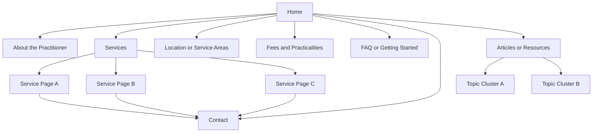
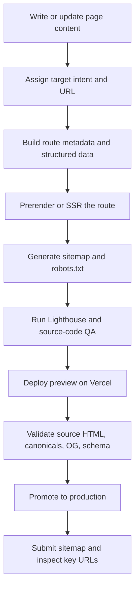

# Practical SEO Guide for Small Professional Service Websites

## Executive Summary

For a small, single-practitioner counselling, coaching, or therapy-style website, SEO is less about “hacks” and more about making the site easy to crawl, easy to trust, easy to understand, and easy to choose. Google’s own documentation still comes back to the same fundamentals: make pages crawlable and indexable, publish genuinely helpful people-first content, use clear titles and descriptive URLs, maintain strong technical hygiene, and monitor performance in Search Console. For a website with fewer than about 50 pages, the highest-return work is usually: render meaningful HTML for each important route, create a clean service-page architecture, optimize title tags and internal linking, verify and maintain a Google Business Profile, implement baseline structured data, and measure leads rather than vanity traffic alone. citeturn7search14turn14search13turn11search1turn31search0turn13search5

For React + Vite sites in particular, the biggest SEO risk is shipping a client-only SPA whose initial HTML is thin, generic, or identical across routes. Google can process JavaScript, but rendering adds complexity and delay, and Google explicitly notes that server-side or pre-rendering is still a great idea because it is faster for users and crawlers and because not all bots run JavaScript. For most small professional-service sites, build-time prerendering or static generation is the best default; request-time SSR is useful when content changes frequently or depends on runtime data; pure CSR should be reserved for genuinely app-like experiences, not brochure-style marketing pages. citeturn36view1turn15search5turn32view1turn16search15

Local SEO is usually decisive for this category. Google Business Profile is free, built for storefront and service-area businesses, and directly affects visibility in Search and Maps. Reviews, profile completeness, local citations, and consistent business information still matter, but the emphasis should be on accuracy and trust rather than directory spam. Ethical local link acquisition, community partnerships, and professional listings tend to outperform generic link schemes. citeturn32view4turn10search10turn9search0turn34view3turn34view4turn23search2

One important current update: FAQ rich results have effectively disappeared for normal commercial sites. Google announced that the FAQ rich result would no longer appear starting May 7, 2026, and then removed the documentation in June 2026. You can still publish FAQ content because it helps users, and you can still use structured data when it accurately describes the page, but you should not expect the old accordion-style FAQ SERP enhancement as an SEO payoff. citeturn34view0turn34view1

## Assumptions and decision framework

This guide assumes a small website, usually under about 50 URLs, for a single practitioner or very small practice; a local lead-generation model rather than e-commerce; at least some face-to-face or local service eligibility for Google Business Profile; a likely Australia-first audience, while still keeping the implementation portable to other regions; and some access to developer support for build, hosting, redirects, and structured data. For a site this size, crawl budget is not a strategic concern. Google’s crawl-budget guidance explicitly says that if a site does not have a large number of rapidly changing pages, simply keeping the sitemap current and checking indexing regularly is adequate. citeturn32view5turn37search13

The most practical way to think about priorities is this: first make each important page technically indexable, then make it useful and trust-building, then make it locally relevant, then measure lead quality and iterate. That order matters because no amount of keyword work compensates for route-level rendering problems, duplicate pages, broken canonicals, or missing indexable HTML. Likewise, technical perfection does not compensate for vague pages that do not match user intent, especially in a trust-sensitive category where prospective clients are often evaluating safety, fit, credibility, and logistics before they make contact. citeturn14search13turn36view1turn11search1turn12search1

The rendering decision usually determines the rest of the SEO stack. The comparison below synthesizes Google’s JavaScript SEO guidance, Vite’s static/SSR docs, React server-rendering docs, and Vercel’s framework guidance. citeturn36view1turn15search5turn32view1turn16search15turn15search16

| Option | Best fit | SEO strengths | SEO risks | Recommendation |
|---|---|---|---|---|
| Client-only SPA | Logged-in apps, dashboards, tools | Fast dev workflow; simple hosting | Thin initial HTML, route metadata issues, slower or less reliable indexing, soft-404 risks, link-discovery issues if routing is poorly implemented | Avoid as the primary architecture for brochure/service sites |
| Prerender or static generation | Small marketing sites, stable service pages, blogs updated on deploy | Full HTML at build time, strong crawlability, easy hosting/CDN caching, simpler QA | Rebuild needed for content edits unless CMS/webhooks are wired in | **Best default** for most small professional-service sites |
| Request-time SSR | Frequently refreshed content, per-request routing logic, runtime personalisation | Full HTML response, route-level metadata, better crawler experience than CSR | More complexity, more ops overhead, caching discipline required | Good when content cannot reasonably be prerendered |
| ISR or equivalent framework regeneration | Medium-change marketing content where rebuilds are too frequent | HTML-first plus freshness | Not native to plain Vite; usually requires a framework with built-in regeneration support | Useful if you outgrow plain Vite and migrate to a framework with this feature |

If you are staying in plain React + Vite, the safest implementation pattern is: prerender all core marketing routes, keep canonical tags and route metadata in the generated HTML, generate the sitemap during build, and use clean server-side redirects for retired URLs. If you need true request-time rendering or incremental regeneration, consider a React framework with that capability rather than layering fragile bot-specific workarounds onto a CSR site. Google explicitly describes dynamic rendering as a workaround and not a recommended solution. citeturn33view3turn33view2turn33view0turn35search0turn36view1

## Technical SEO and deployment architecture

The technical goal is straightforward: every important route should return a crawlable page with meaningful HTML, a unique title, a matching canonical, an internally linked URL, and a fast, stable, mobile-friendly experience. Google discovers most pages automatically through links, parses URLs from standard `<a href>` elements, and uses rendered HTML for indexing when JavaScript is involved. For small sites, this means the home page, service pages, about page, locations or service-area pages, pricing or fees page if applicable, FAQ/help content, contact page, and a small number of articles should all exist as distinct URLs with visible content in the DOM. citeturn14search13turn36view1turn25search0

React/Vite-specific pitfalls are unusually common on small service sites because teams often treat them like apps rather than search-facing websites. Google recommends using the History API instead of URL fragments, ensuring links are real `<a>` elements with `href` attributes, avoiding soft 404 behavior in SPAs, and using server-side or pre-rendering where possible. In practice, that means no hash routes such as `/#/anxiety-support`, no service pages that only appear after clicking a tab or accordion without their own URL, no route-specific metadata injected only after hydration if it can be avoided, and no faux 404 pages that still return `200 OK`. citeturn36view0turn36view1turn36view2

Core Web Vitals and page experience matter because they shape both usability and search competitiveness. Google says Core Web Vitals measure loading, interactivity, and visual stability, and Search Console’s Core Web Vitals report is based on real-world field data from Chrome users. For these sites, the common wins are compressing and dimensioning hero images, reducing unnecessary client-side JavaScript, delaying non-essential scripts, using system or cached fonts carefully, and avoiding layout shift from banners, maps, or late-loading embeds. Lighthouse and PageSpeed Insights are the fastest debugging tools; Search Console and CrUX show real user impact over time. citeturn26search8turn12search13turn26search2turn26search1turn25search3turn26search3

Accessibility is not a standalone SEO ranking trick, but it supports both usability and machine understanding. W3C guidance emphasizes proper heading structure and semantic regions, while Google recommends descriptive alt text and other semantic basics that help search engines understand page meaning. For a professional-service site, this is also part of trust: a clear heading hierarchy, accessible forms, high contrast, descriptive button labels, and landmarks such as `<main>` and `<nav>` improve both human and crawler comprehension. citeturn29search5turn29search2turn29search0turn4search14

A small-site implementation checklist is usually best kept simple. The table below is a practical priority framework built from Google Search Central, schema.org, Vite, React, W3C, and Vercel guidance. citeturn7search14turn36view1turn32view3turn37search13turn37search1turn15search5turn32view1turn33view0turn33view1

| Priority | Technical action | Why it matters | How to verify |
|---|---|---|---|
| Must-do | Prerender or SSR all indexable routes | Ensures route-level HTML, titles, canonicals, and content are visible | View source, URL Inspection live test, Rich Results Test |
| Must-do | Unique `<title>` on every page | Strong influence on title links and click decisions | Search Console, manual page-source review |
| Must-do | Self-referential canonical on every indexable page | Consolidates duplicate signals and prevents ambiguity | View source, URL Inspection |
| Must-do | XML sitemap listing canonical URLs only | Helps discovery and reinforces preferred URLs | Search Console sitemap report |
| Must-do | Clean robots.txt plus page-level robots meta where needed | Controls crawling and indexing behavior | Manual fetch, robots tester equivalents, URL Inspection |
| Must-do | 301 redirects for renamed or removed pages | Preserves link equity and user experience | Crawl old URLs, inspect headers |
| Must-do | Human-readable URL design | Aids users and search engines | Crawl output, naming review |
| Should-do | LocalBusiness/ProfessionalService/Organization/Person/Service schema | Improves entity understanding and local clarity | Rich Results Test, source-code review |
| Should-do | Open Graph and optional X card tags | Improves social previews and share quality | Social validators, Vercel OG preview |
| Should-do | Performance budget and CWV review before every release | Prevents regressions | Lighthouse, PSI, Search Console |
| Optional | hreflang | Only needed for true multi-language or multi-region equivalents | Source review, Search Console checks |
| Optional | Crawl-log analysis | Useful mainly when debugging crawl anomalies | Server/CDN logs, Crawl Stats report |

For site structure, keep the hierarchy shallow and obvious. The recommended information architecture below is intentionally small and intent-led: it makes service pages indexable, gives local cues without duplicating thin pages, and preserves room for content clustering without turning the site into a sprawling blog. The logic aligns with Google’s guidance on discoverability, internal linking, and descriptive URL structure. citeturn14search13turn31search0turn7search14



The snippet patterns below reflect official guidance for canonical tags, robots meta tags, sitemaps, structured data, and Open Graph. They are examples, not copy-paste prescriptions. Replace placeholders with real data, and keep the visible page content consistent with the markup. Use JSON-LD for schema where possible, because Google recommends it and it is easier to maintain. citeturn32view3turn14search17turn37search13turn7search7turn7search4turn5search0

```html
<!-- Core meta -->
<title>Anxiety Counselling in Perth | Calm, Practical Support</title>
<meta name="description" content="Support for anxiety, stress, and overwhelm with practical counselling tailored to adults in Perth. Learn how sessions work, fees, and next steps." />
<meta name="robots" content="index,follow" />
<link rel="canonical" href="https://www.example.com/anxiety-counselling-perth/" />

<!-- Open Graph -->
<meta property="og:type" content="website" />
<meta property="og:title" content="Anxiety Counselling in Perth | Calm, Practical Support" />
<meta property="og:description" content="Support for anxiety, stress, and overwhelm with practical counselling tailored to adults in Perth." />
<meta property="og:url" content="https://www.example.com/anxiety-counselling-perth/" />
<meta property="og:image" content="https://www.example.com/og/anxiety-counselling.jpg" />
<meta property="og:image:alt" content="Calm counselling office with two chairs and natural light" />

<!-- Optional X card tags -->
<meta name="twitter:card" content="summary_large_image" />
<meta name="twitter:title" content="Anxiety Counselling in Perth | Calm, Practical Support" />
<meta name="twitter:description" content="Support for anxiety, stress, and overwhelm with practical counselling tailored to adults in Perth." />
<meta name="twitter:image" content="https://www.example.com/og/anxiety-counselling.jpg" />
```

```txt
# robots.txt
User-agent: *
Allow: /

# Block internal search or duplicate utility paths if they exist
Disallow: /search
Disallow: /preview

Sitemap: https://www.example.com/sitemap.xml
```

```xml
<?xml version="1.0" encoding="UTF-8"?>
<urlset xmlns="https://www.sitemaps.org/schemas/sitemap/0.9">
  <url>
    <loc>https://www.example.com/</loc>
    <lastmod>2026-07-13</lastmod>
  </url>
  <url>
    <loc>https://www.example.com/anxiety-counselling-perth/</loc>
    <lastmod>2026-07-13</lastmod>
  </url>
  <url>
    <loc>https://www.example.com/about/</loc>
    <lastmod>2026-07-13</lastmod>
  </url>
</urlset>
```

```html
<!-- Canonical example -->
<link rel="canonical" href="https://www.example.com/relationship-counselling/" />
```

```html
<script type="application/ld+json">
{
  "@context": "https://schema.org",
  "@type": "ProfessionalService",
  "@id": "https://www.example.com/#business",
  "name": "Example Counselling",
  "url": "https://www.example.com/",
  "telephone": "+61-8-5555-5555",
  "email": "hello@example.com",
  "image": "https://www.example.com/images/office.jpg",
  "priceRange": "$$",
  "areaServed": {
    "@type": "AdministrativeArea",
    "name": "Perth"
  },
  "address": {
    "@type": "PostalAddress",
    "streetAddress": "100 Example Street",
    "addressLocality": "Perth",
    "addressRegion": "WA",
    "postalCode": "6000",
    "addressCountry": "AU"
  },
  "sameAs": [
    "https://www.facebook.com/example",
    "https://www.linkedin.com/company/example"
  ]
}
</script>
```

For Vite + Vercel deployment, use build-time or server-render-time metadata injection rather than relying on a single generic `index.html` for every route. Vite supports HTML environment replacement, Vercel supports version-controlled project configuration, headers, redirects, and clean URLs, and Vite supports SSR if you need it. citeturn33view3turn33view0turn32view1turn32view0

| Deployment task | Recommended implementation |
|---|---|
| Route rendering | Prerender all public routes or use SSR for content that changes between builds |
| Meta tags | Generate route-specific `<title>`, description, canonical, OG tags during build/render |
| Sitemap | Generate at build time from route list or content source |
| robots.txt | Static file in public directory or generated as part of build |
| Canonicalization | One preferred hostname and protocol; self-canonical on preferred URLs |
| Redirects | Permanent redirects in `vercel.json` for retired URLs and domain consolidation |
| Headers | Add security headers and any cache directives in Vercel config |
| QA | Check page source, Search Console URL Inspection, PSI, Lighthouse, Rich Results Test |

A simple deployment flow for small content sites is below. This keeps SEO artifacts in the build pipeline instead of treating them as afterthoughts. citeturn33view0turn33view2turn15search17



Two implementation traps cause disproportionate damage on these sites. First, developers sometimes use `robots.txt` as a privacy mechanism; Google’s robots guide is explicit that robots rules do not enforce access controls and should not be used to protect sensitive content. Second, teams often generate schema or canonicals with JavaScript only after hydration; Google can sometimes pick these up, but Google’s canonical guidance says the clearest approach is to specify them in HTML source. citeturn14search17turn32view3turn36view3

## On-page SEO and content operations

Keyword research for a counselling-style site should start with real service intent, not broad inspirational language. The useful buckets are usually service intent, problem intent, fit/eligibility intent, and logistics intent. Examples are patterns such as “anxiety counselling [city],” “relationship counselling near me,” “how therapy for stress works,” “counsellor fees [city],” or “counselling for burnout adults.” Search intent is the reason behind the query, and the page should match that reason directly. Google’s people-first content guidance and title-link guidance both strongly favor pages that are clear, descriptive, and genuinely useful rather than pages written to force keywords onto thin content. citeturn11search0turn11search1turn11search2turn11search7

For this niche, a strong page template is usually more important than chasing arbitrary word counts. Google does not reward length for its own sake. A good service page should satisfy commercial-investigative intent by answering five things clearly: what the service is, who it helps, what it may help with, how sessions work, and what next steps look like. Supporting sections should remove friction: practicalities, modalities used, online vs in-person availability, fees, FAQs, and a calm call to action. This usually outperforms generic therapy jargon such as “holding space” or “supporting transformation” when the page never tells a searcher what is actually offered. That last point is an editorial inference, but it follows directly from Google’s people-first guidance and from title/snippet clarity guidance. citeturn11search1turn11search2turn5search2turn25search4

Trust signals carry extra weight in health-adjacent decision-making. Google’s people-first content guidance explicitly points creators to E-E-A-T as a self-assessment lens. On small professional-service sites, the practical translation is straightforward: publish a real practitioner bio, credentials, registration or memberships where relevant, your approach and experience, clear contact details, a physical location or explicitly defined service area, policies, fees, and realistic expectations about what the service can and cannot do. Add an editorial last-reviewed date only when the content is actually reviewed; do not fake freshness by changing dates without meaningful updates. citeturn12search1turn12search3turn7search14turn34view0

Headings and internal linking are underused on small sites. W3C notes that headings communicate page organization and support in-page navigation, while Google uses titles, headings, and internal links to understand pages. Give each service page one clear H1 tied to the user’s intent, then use descriptive H2s such as “Who this service may help,” “What sessions look like,” “Fees and practicalities,” and “Common questions.” Link between problem pages and service pages in both directions so that informational content can hand people to commercial pages, and service pages can link out to deeper educational resources where helpful. citeturn29search5turn11search7turn14search13

Meta descriptions do not directly rank pages, but they do influence how well a result earns clicks when Google chooses to use them. Keep them specific, local where relevant, and aligned with the visible page. Titles should be descriptive and concise; avoid vague defaults such as “Home,” keyword stuffing, or repeating the business name on every page before the actual topic. For image-heavy pages, write descriptive alt text for photographs that matter contextually, not decorative fillers. citeturn11search2turn5search2turn29search0turn29search3

A practical content model for this niche is usually one pillar page per main service area plus a small group of supporting articles. Example clusters might be anxiety, burnout/stress, relationship difficulties, grief/life transitions, and “starting counselling.” Static pages should carry the commercial and trust-heavy material; blog or resource posts should answer recurring questions, clarify fit, and build topical relevance. If there is no ongoing capacity to publish well, a resource library with occasional high-quality updates is usually better than a neglected blog. Google explicitly recommends creating content for people rather than publishing for search traffic alone. citeturn11search1turn11search6turn7search14

Because FAQ rich results are gone for normal sites, publish FAQ content for usability, not for SERP decoration. Keep FAQ sections where they reduce friction, but do not expect a rich-result uplift. If you use FAQPage markup, use it because the page is genuinely a FAQ page, not as a mechanical SEO add-on. citeturn34view0turn34view1turn6search3

The structured-data mix below is the most practical baseline for this type of site. This table synthesizes Google’s supported-structured-data guidance and schema.org type definitions. citeturn7search8turn7search13turn6search5turn27search6turn27search2turn27search1

| Markup type | Best page | Use case | Notes |
|---|---|---|---|
| `Organization` | Home page | Brand and entity identity | Good baseline for every business site |
| `ProfessionalService` or `LocalBusiness` | Home page / contact page | Local service identity, hours, address, service area | Use the most specific accurate type |
| `Person` | Practitioner bio page | Practitioner identity, sameAs, credentials context | Particularly valuable for single-practitioner sites |
| `Service` | Individual service pages | Describe specific offerings | Useful for topic clarity even without a guaranteed rich result |
| `FAQPage` | True FAQ page only | Page genuinely organized as questions and answers | Not a current Google rich-result tactic for most sites |
| Review markup | Usually avoid on your own service pages | Only where eligible and not self-serving | Google disallows self-serving review rich-result behavior for your own business pages |

A sample intent-aligned outline for a counselling service page would look like this:

```markdown
H1: Anxiety Counselling in Perth

Intro:
A calm, plain-English overview of who the service is for and what first sessions are like.

H2: Signs this service may be a fit
- Persistent worry
- Sleep disruption
- Panic or overwhelm
- Work stress and overthinking

H2: How anxiety counselling works
- What happens in a first session
- Practical approaches used
- What goals might look like

H2: Sessions, fees, and availability
- In-person / online
- Session length
- Fees and rebates if applicable

H2: About the practitioner
- Relevant background
- Experience with anxiety-related concerns
- Approach and values

H2: Common questions
- Do I need a referral?
- How many sessions do people usually have?
- What if I am not sure counselling is right for me?

H2: Next step
- Simple CTA to contact or book
```

Common on-page pitfalls are easy to spot if you review pages manually. The worst offenders are duplicate titles, near-identical service pages with only a suburb name changed, bloated intros that never state the service clearly, no visible practitioner information, and content that speaks in abstractions instead of answering user concerns. You can catch most of these with a simple crawl, a spreadsheet, and a copy review. citeturn11search2turn25search4turn7search14

## Local SEO, reviews, and ethical link acquisition

If the practitioner serves clients face to face or travels to meet clients, create and verify a Google Business Profile. Google’s help documentation is explicit that Business Profiles are for storefront and service-area businesses that have face-to-face contact with customers, not online-only businesses. Once verified, keep the profile complete with accurate hours, website, phone, location or service area, photos, service categories, and any booking links that genuinely help prospects move forward. citeturn32view4turn8search0turn8search5

For service-area businesses, keep the setup precise rather than expansive. Google allows up to 20 service areas and says the overall area should not be more than about two hours of driving time from the business base. If clients do not visit your address, remove the visible street address and use the service area only. If clients do visit in person as well, use both the address and the service area. citeturn33view5turn10search8turn10search2

Reviews remain one of the highest-trust assets in local SEO, but they have to be collected cleanly. Google recommends asking customers to leave reviews and replying to them, and Google’s Maps content policies prohibit fake engagement, including incentivized or biased reviews. For counselling-style services, a cautious, ethics-first review workflow is especially important: request reviews only where appropriate, never pressure clients, never screen for only positive experiences, and never offer gifts or discounts in exchange. citeturn9search0turn9search1turn9search14turn34view3

Citations still matter, but they are not the main game anymore. Ahrefs’ local SEO guide summarizes the modern view well: citations are somewhat important, but less important than they once were. The practical takeaway for small professional-service sites is to maintain consistent NAP and website data across the handful of places that real prospective clients and search engines are likely to use: Google Business Profile, Apple and Bing ecosystems where relevant, key professional directories, local associations, chambers of commerce, and major social profiles. Accuracy beats volume. citeturn34view3

Local schema should reinforce, not contradict, the public profile and citations. Use the same business name, phone number, address or service-area strategy, and website URL across the site, schema, and Google Business Profile. Also note one common mistake: do not use self-serving review markup to try to win stars for your own business pages. Google explicitly changed review rich-result behavior to suppress self-serving reviews. citeturn6search5turn27search6turn28search3

Ethical link building for this niche is relationship work, not manipulation. Google’s spam policies prohibit deceptive link tactics, and local-link guidance from Ahrefs shows that most local businesses do not need a huge backlink profile. The best links usually come from professional associations, local chambers, referral partners, reputable directories that rank for category queries, community organizations, speaking engagements, podcasts, event pages, local media, scholarships, workshops, or useful locally relevant resources you create. Reclaim unlinked mentions, fix broken old links with redirects, and avoid mass outreach to irrelevant sites. citeturn23search2turn23search5turn34view4

A simple local-offsite priority model works well:

| Priority | Focus | Examples |
|---|---|---|
| Must-do | Google Business Profile | Verification, categories, hours, photos, services, website, review link |
| Must-do | NAP consistency | Website footer/contact page, GBP, major directories, practitioner profiles |
| Should-do | Reputable local/professional listings | Chamber, association directories, local health/community networks |
| Should-do | Review process | Post-session follow-up where appropriate and ethical |
| Optional | Community link building | Talks, collaborations, local podcasts, workshops, community sponsorships |

The clearest local pitfalls are over-broad service areas, duplicate listings, outdated hours or phone numbers, and directory sprawl with inconsistent data. Detection is manual: search the business name, phone number, and address variations; compare top directory entries; and review the profile as a logged-out user in Search and Maps. citeturn32view4turn10search4turn33view5

## Measurement, analytics, and KPIs

Measurement should start with business outcomes, not pageviews. For this site category, the most meaningful primary conversions are usually contact-form submissions, booking requests, click-to-call events, email-click events, and referrals from Google Business Profile. Search Console and Google Analytics should then tell you how search visibility contributes to those actions. Google’s own beginner materials for GA4 emphasize setting conversions, and Search Console’s Performance report gives the search-side metrics—clicks, impressions, CTR, and average position—that explain why those conversions are rising or stalling. citeturn13search10turn25search4turn13search5

The minimum stack for small sites is Search Console, GA4, Bing Webmaster Tools, PageSpeed Insights or Lighthouse, and a simple rank-tracking process for a limited keyword set. Search Console should be used weekly for indexing issues, clicks, impressions, CTR, and top queries. URL Inspection should be used for new or changed pages. Bing Webmaster Tools adds sitemap submission, URL inspection, and site-scan visibility for Bing. Lighthouse is useful before deployment; PSI and Search Console show how those lab improvements translate to field performance. citeturn25search0turn13search5turn9search3turn25search2turn25search5turn25search3turn26search1

If the site is very small, do not over-invest in crawl-budget or log-file analysis. Google’s crawl-budget documentation is explicit that small, slowly changing sites usually do not need special crawl-budget work. Log analysis is still useful when there is a real problem—unexpected deindexing, repeated bot hits on old URLs, rendering anomalies, or hosting-level errors—but it should be treated as optional diagnostics, not routine KPI work. Search Console’s Crawl Stats report is usually enough for first-pass debugging. citeturn32view5turn13search1turn13search3

One current addition worth knowing is Google’s Search Generative AI performance reporting. In June 2026, Google announced dedicated Search Console reporting for visibility in generative AI features such as AI Overviews and AI Mode, rolling out first to a subset of sites. If available on your property, treat it as an additional visibility lens rather than a separate SEO channel. The underlying work is still the same: crawlable content, semantic structure, clear answers, and strong page quality. citeturn34view2turn11search1

A practical KPI set for the first six months is below. The targets themselves depend on competition, but these categories are the right ones to watch. citeturn25search4turn13search10turn26search2

| KPI | What to watch | Why it matters |
|---|---|---|
| Organic conversions | Form submissions, booking requests, calls, email clicks | Direct business outcome |
| Indexed core pages | All key service and trust pages indexed | Baseline discoverability |
| Impressions | Growth for target queries and locations | Early signal before traffic |
| Organic CTR | Underperforming pages/queries with strong impressions | Snippet and title opportunity |
| Average position | Service and local query trends | Directional ranking signal |
| Core Web Vitals | Good / needs improvement / poor page groups | UX and competitive quality |
| GBP actions | Calls, website visits, direction requests where relevant | Local intent performance |
| Content contribution | Which pages assist conversions | Editorial prioritization |

The most reliable monitoring cadence is modest and disciplined. Review Search Console weekly, GA4 weekly, technical QA monthly, and a full content/local-SEO audit quarterly. Before and after major deployments, run Lighthouse, confirm source HTML and canonical tags, and inspect at least the home page, one service page, the contact page, and the sitemap. citeturn13search5turn25search0turn25search3turn37search13

## Privacy, security, and ongoing maintenance

Privacy and confidentiality are not side issues for this site category. In Australia, the OAIC’s guidance on the Australian Privacy Principles makes clear that higher standards apply to sensitive information and that organizations holding personal information must take reasonable steps to protect it. For enquiry forms on counselling-style sites, the safest practical approach is data minimization: ask for name, preferred contact method, broad reason for contact if necessary, and scheduling details—then avoid asking for detailed clinical histories or highly sensitive disclosures in a first-touch form. Route people to a secure conversation for anything sensitive. citeturn18search1turn18search5turn18search16turn18search18

If you serve or market to users in the EU or UK, cookie consent becomes stricter. The EDPB and European Commission both distinguish essential cookies from analytics or preference cookies that require consent. So the practical rule is: if you fire non-essential analytics, advertising, or personalization scripts for those users, implement consent management so those scripts do not run before consent. For an Australia-focused brochure site with minimal measurement, the simplest privacy-friendly setup is often first-party analytics with no ad tech, a clear privacy policy, and a minimal cookie surface. citeturn19search1turn19search6turn18search3turn18search18

Security basics are non-negotiable. Google has long used HTTPS as a ranking signal, and web.dev emphasizes that HTTPS protects the integrity of communications between the site and users. On Vercel, HTTPS and HSTS are already strong defaults, and Vercel allows additional response-header configuration for broader security controls such as CSP and related headers. For forms, also use spam protection, rate limiting where available, and confirmation flows that do not expose personal data in URLs. citeturn20search0turn20search1turn33view1turn21search0

For hosting and release management on Vercel, use preview deployments for QA, store configuration in version control, and keep rollback paths ready. Vercel documents project-level configuration, deployment protection, and instant rollback for production recovery. That means SEO is safer when redirects, headers, and output settings live in the repository, not only in the dashboard, and when preview environments are checked before public release. citeturn33view0turn22search2turn22search0turn22search12

A strong maintenance routine prevents nearly all small-site SEO drift. The cadence below is practical for this class of site and aligns with Google’s monitoring/debugging tools and Vercel’s deployment workflow. citeturn13search5turn25search0turn13search1turn22search0

| Cadence | Routine |
|---|---|
| Weekly | Check Search Console performance, indexing anomalies, core pages, and new 404s; check GBP messages/reviews; review main lead metrics in GA4 |
| Monthly | Crawl the site, review title/meta/canonical consistency, test forms, validate schema on key pages, review CWV/PageSpeed, clean redirects |
| Quarterly | Refresh key service pages, update practitioner bio and practical details, review local citations, update older articles, prune weak pages |
| Before each release | Run Lighthouse, inspect source HTML, validate sitemap/robots/canonicals, test redirects, ensure no accidental noindex on live pages |

A sample 90-day action plan with weekly milestones is below. It is intentionally conservative and practical for implementers working with developer support. citeturn7search14turn36view1turn32view4turn13search5

| Week | Focus | Outcome |
|---|---|---|
| Week 1 | Benchmark current state | Search Console, GA4, Bing Webmaster, GBP access confirmed; baseline KPI sheet created |
| Week 2 | Rendering and indexing audit | Confirm HTML output for all core routes; map CSR risks and soft-404 issues |
| Week 3 | Canonical, robots, sitemap cleanup | Preferred URL rules defined; sitemap submitted; robots reviewed |
| Week 4 | Redirect and URL cleanup | 301 map for old/duplicate URLs; clean URL naming applied |
| Week 5 | Title/meta rewrite for core pages | Home, services, about, contact, fees all rewritten and QA’d |
| Week 6 | Structured data rollout | Organization / ProfessionalService / Person / Service markup deployed |
| Week 7 | Internal-linking pass | Service pages, FAQ/help pages, and resources cross-linked intentionally |
| Week 8 | GBP optimization | Categories, services, hours, photos, booking links, service areas verified |
| Week 9 | Review workflow | Ethical review-request process documented and launched |
| Week 10 | Content cluster planning | Pillar pages and 6–12 supporting article ideas mapped to intent |
| Week 11 | Publish first supporting resources | Launch priority articles that support core service pages |
| Week 12 | Performance and accessibility pass | Lighthouse/PSI fixes prioritized; image, font, and layout-shift issues addressed |
| Week 13 | Review and next-quarter plan | Compare KPI delta to baseline; decide next content, local, and technical iterations |

The biggest long-term maintenance pitfall is not technical debt alone but “content drift”: services change, availability changes, fees change, addresses change, and bios age quietly. On these sites, outdated practical details erode trust faster than almost any ranking problem. Treat the website like an operational asset, not just a marketing brochure, and the SEO tends to hold together much better. citeturn32view4turn10search4turn11search1

Recommended resources, prioritized by authority, are: Google Search Central documentation and Search Console, schema.org, W3C WAI resources, Vite docs, React server-rendering docs, Vercel docs, Chrome’s Lighthouse and PageSpeed Insights docs, Google Business Profile Help, Bing Webmaster Tools, and then reputable third-party references such as Ahrefs, Moz, and Search Engine Journal for keyword research, local SEO workflows, and outreach tactics. citeturn12search16turn6search0turn4search9turn17search2turn16search15turn15search9turn25search3turn26search1turn9search2turn25search21turn11search3turn23search7
